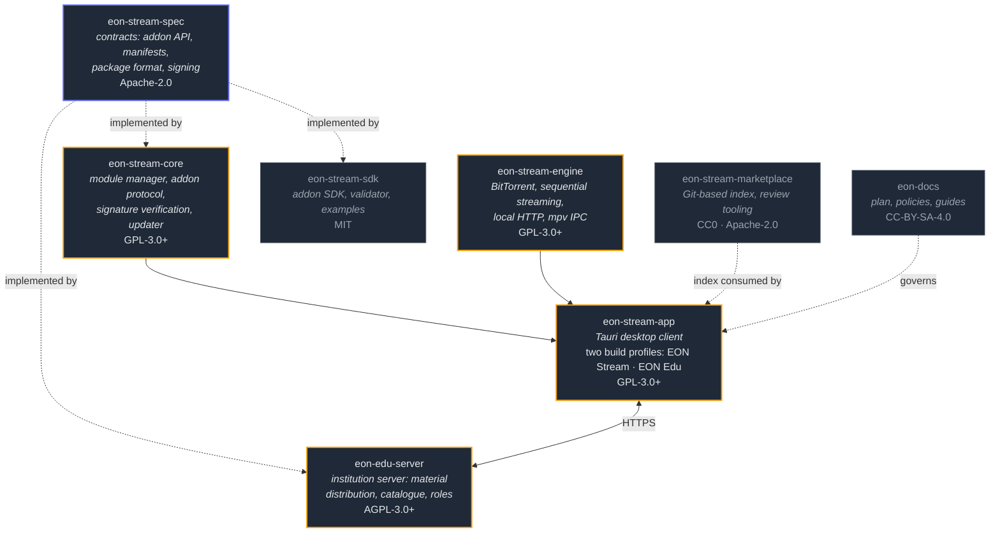

<h1 align="center">EON</h1>

<strong>Extensible Open Network</strong>

<em>An open ecosystem for everyone.</em>

  <a href="https://github.com/EON-Extensible-Open-Network/eon-docs/blob/main/plan/eon-plan.md">Project plan</a> ·
  <a href="https://github.com/EON-Extensible-Open-Network/eon-stream-spec">Contracts</a> ·
  <a href="https://github.com/EON-Extensible-Open-Network/.github/blob/main/CONTRIBUTING.md">Contributing</a>

---

EON is an umbrella, not a product. Everything under it is open source, non-profit, and built
on shared contracts rather than a shared codebase by accident.

Two products today:

### EON Stream

A media viewer built on a small core where **everything else is a module** — video, files, the
marketplace, the creator tools. It speaks the Stremio addon protocol, so the existing addon
ecosystem works, and it is written in Rust on top of Tauri and mpv.

### EON Edu

The same core, compiled as an institutional product for schools and remote teaching. The open
marketplace, arbitrary addon URLs, and open BitTorrent access are not hidden in that build —
they are **absent at compile time**, and CI verifies it.

One umbrella, one core, two products. A student opens material downloaded at school with the
same engine at home, and a teacher learns one creator tool.

## Architecture

The contracts come first and everything implements them. That is deliberate: the addon API,
the manifest schema and the package format are the parts that cannot be changed later without
breaking other people's work, so they live in their own repository, under a permissive license,
versioned independently of any implementation.

## Repositories

Naming follows `eon-<product>-<component>`. Repositories that belong to the umbrella rather
than to one product carry no product name.

| Repository | What it is | Status | License |
|---|---|---|---|
| [**eon-stream-spec**](https://github.com/EON-Extensible-Open-Network/eon-stream-spec) | Contracts: addon API, manifest schemas, package format, signing and revocation | Faz 0 · active | `Apache-2.0` |
| [**eon-stream-core**](https://github.com/EON-Extensible-Open-Network/eon-stream-core) | Rust library: module manager, addon protocol client, signature verification, updater | Faz 0 · active | `GPL-3.0-or-later` + module exception |
| [**eon-stream-engine**](https://github.com/EON-Extensible-Open-Network/eon-stream-engine) | Rust library: BitTorrent, sequential streaming, local HTTP server, mpv IPC | Faz 0 · active | `GPL-3.0-or-later` + module exception |
| [**eon-stream-app**](https://github.com/EON-Extensible-Open-Network/eon-stream-app) | Tauri desktop client; both the EON Stream and EON Edu build profiles | Faz 0 · active | `GPL-3.0-or-later` + module exception |
| [**eon-docs**](https://github.com/EON-Extensible-Open-Network/eon-docs) | The project plan, versioned policies, user and institution guides | Faz 0 · active | `CC-BY-SA-4.0` |
| [**eon-stream-sdk**](https://github.com/EON-Extensible-Open-Network/eon-stream-sdk) | Addon developer SDK, manifest validator CLI, example addons | Faz 2 · scaffold | `MIT` |
| [**eon-stream-marketplace**](https://github.com/EON-Extensible-Open-Network/eon-stream-marketplace) | Git-based marketplace index and review tooling | Faz 2 · scaffold | `CC0-1.0` / `Apache-2.0` |
| [**eon-edu-server**](https://github.com/EON-Extensible-Open-Network/eon-edu-server) | Institution server: material distribution, catalogue, roles, school tools | Faz 3 · scaffold | `AGPL-3.0-or-later` |

*Scaffold* means the scope and contracts are written down but implementation has not started.
The phase is stated so nobody mistakes a planned repository for an abandoned one.

## Status

**Faz 0 — foundations.** There is no usable release. The contracts are at `v0` and explicitly
unstable.

What EON Stream v1 will be, and nothing more: a Windows and Linux desktop application that
resolves Stremio-compatible addons, plays with mpv, streams from BitTorrent sequentially,
manages first-party modules with signature verification, supports declarative themes, passes a
pinned addon compatibility suite, and ships in Turkish and English meeting a baseline
accessibility bar.

Not in v1: marketplace, accounts, creator tools, material packages, music, mobile,
code-executing plugins, Edu.

The [project plan](https://github.com/EON-Extensible-Open-Network/eon-docs/blob/main/plan/eon-plan.md) is the real
roadmap. Its decisions are numbered and permanent — `madde 22` means the same thing forever —
and they are referenced from code comments, pull requests, and these documents. When something
changes, that plan is what gets updated.

## What EON Stream is not

Stated up front because it defines the project as much as the feature list does:

- It **hosts no content and indexes no content**. It connects to endpoints the user adds.
- It **ships with no sources and no addons preinstalled**, ever.
- It publishes **no guides, lists, or recommendations** for obtaining infringing content, and
  does not allow them in its community spaces.
- It sends **no telemetry**. Not off-by-default-but-present: absent.
- It stores **no Turkish national ID numbers** and holds **no student data** — in EON Edu the
  institution is the data controller and runs its own server.

The full list, and the reasoning, is madde 29 of the plan. It is a design constraint, not a
marketing paragraph.

## Contributing

Read [CONTRIBUTING.md](https://github.com/EON-Extensible-Open-Network/.github/blob/main/CONTRIBUTING.md) and the
[Code of Conduct](https://github.com/EON-Extensible-Open-Network/.github/blob/main/CODE_OF_CONDUCT.md). Contributions
are taken under the DCO — sign off your commits with `git commit -s`.

Good first contributions right now are in `eon-stream-spec`: the `v0` contracts are being
written, and review of a schema before it hardens is worth more than a bug fix after.

Security issues: [SECURITY.md](https://github.com/EON-Extensible-Open-Network/.github/blob/main/SECURITY.md) — never a
public issue.

---

  
    The code is free; the name is not — see
    <a href="https://github.com/EON-Extensible-Open-Network/.github/blob/main/TRADEMARK.md">TRADEMARK.md</a>. 
    Not affiliated with, endorsed by, or connected to Stremio.
  

